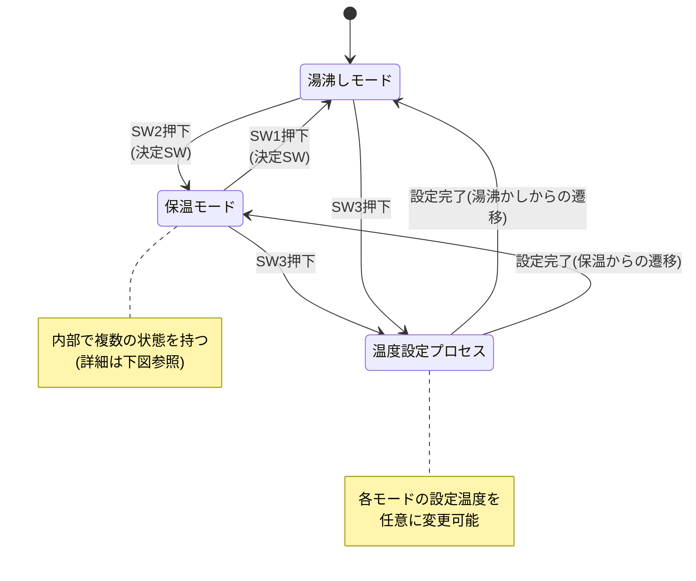
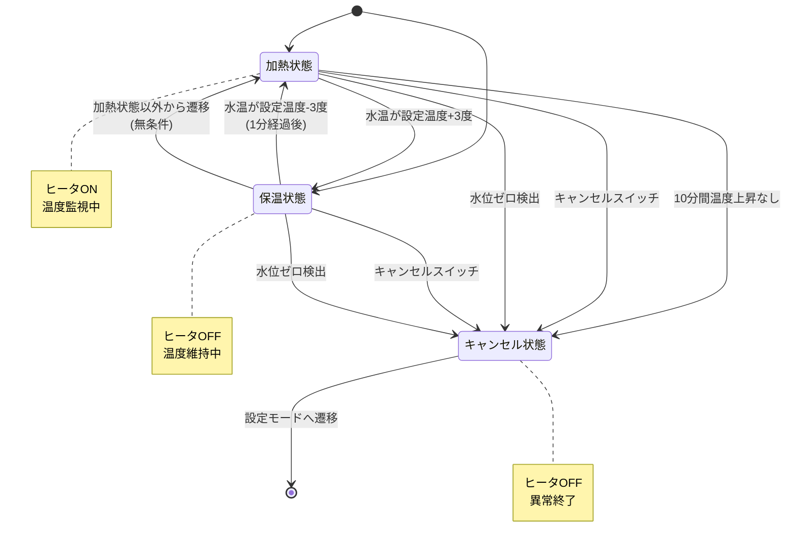

# 保温モード機能仕様書

## 6.2 実験 1: システム実装

実験 II-Type A プログラムリストに掲載されているソフトウェアでは、「**湯沸しモード**」のみが実装されています。このソフトウェアに以下の「**保温モード**」に関する機能仕様を追加します。

---

## 仕様 2-1: 保温モードへの移行動作の追加

システムの最上位レベルの動作として「**保温モード**」への移行動作を追加する。

### 実装内容

1. LED 表示タスクで保温モード時に現在温度を表示するように **case** を追加する。
2. メイン制御タスクで保温モードへの遷移を **case** として追加する。

---

## 仕様 2-2: 温度設定機能

「**保温モード**」内で使用する保温温度を、システムの最上位レベルの動作である「**温度設定機能（プロセス）**」により任意に設定変更できるようにする。

---

## 仕様 2-3: 保温モードの状態遷移

「**保温モード**」は以下の3つの状態間で遷移を繰り返します。

- **加熱状態**
- **保温状態**
- **キャンセル状態**

---

## 仕様 2-4: 加熱状態の動作仕様

加熱状態では、以下の条件に従って動作します。

### 条件と動作

1. **温度上昇時の遷移**
   - 水温が設定水温より $3$ 度高くなるとヒータを停止し、保温状態に遷移する。

2. **温度上昇異常時の遷移**
   - 加熱を $10$ 分連続で行っても温度が上昇しない場合はヒータを止め、キャンセル状態に遷移させる。

3. **キャンセルスイッチ入力**
   - キャンセルスイッチが押されたらキャンセル状態に遷移させる。

4. **水位ゼロ検出時の遷移**
   - 水位がゼロの場合にはヒータを停止し、キャンセル状態に遷移させる。

---

## 仕様 2-5: 保温状態の動作仕様

保温状態では、以下の条件に従って動作します。

### 条件と動作

1. **温度低下時の再加熱（加熱状態からの遷移の場合）**
   - 加熱状態から保温状態に遷移した場合で、水温が設定水温より $3$ 度低くなるとヒータをオンにして加熱状態に遷移する。
   - **制約**: 水温が $3$ 度低下しても加熱状態から $1$ 分が経っていない場合には、再加熱しない。

2. **その他の状態からの遷移の場合**
   - 加熱状態以外から保温状態に遷移した場合には、無条件にヒータをオンし、加熱状態に遷移させる。

3. **異常検出時の遷移**
   - キャンセルスイッチやゼロ水位への対応は加熱状態と同じとする。

---

## 仕様 2-6: キャンセル状態からの遷移

キャンセル状態に遷移したら、設定モードに遷移させる。

---

## 状態遷移図

### 最上位レベルの状態遷移

### 保温モード内の状態遷移

---

## 実装上の注意事項

- 保温温度は温度設定機能により任意に変更可能とする
- 加熱状態から保温状態への遷移後、1分間は再加熱を行わない
- 温度判定は設定温度を基準に±3度のヒステリシスを持つ
- 安全のため、水位ゼロ検出時は即座にヒータを停止する
- 10分間の温度上昇監視により異常検出を行う
